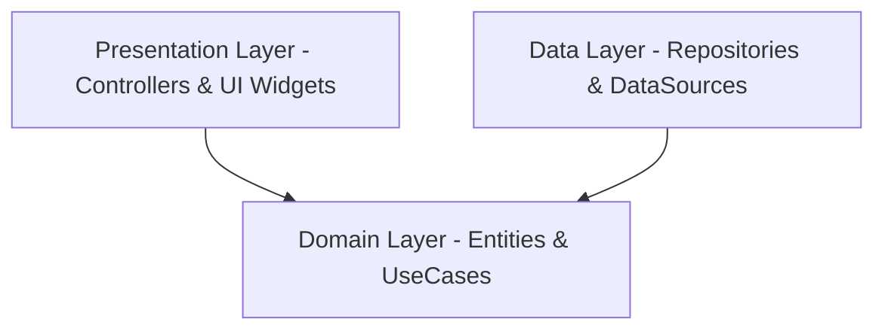

# 📖 Panduan Teknis & Arsitektur Aplikasi Dailio

Dokumen ini dirancang sebagai panduan lengkap untuk memahami sistem, arsitektur, dan alur kerja aplikasi **Dailio — Habit Tracker App**. Panduan ini mencakup identitas brand, desain sistem, struktur basis data, manajemen state, hingga fitur gamifikasi terbaru.

---

## 🧭 1. Ringkasan & Filosofi Produk

**Dailio** adalah aplikasi pelacak kebiasaan (*habit tracker*) modern berorientasi *offline-first* yang fokus pada **konsistensi dan pertumbuhan bertahap** (*Grow Through Consistency*). 

Aplikasi ini dirancang dengan prinsip:
*   **Progress over Perfection**: Mendorong pengguna untuk terus menjaga rantai kebiasaan (*streak*) tanpa menghakimi saat mereka terlewat.
*   **Calm Productivity**: Antarmuka bertema gelap yang menenangkan (*Deep Slate, Emerald Green, Soft Blue*), mencegah pengguna mengalami burnout psikologis atau kecemasan produktivitas.

---

## 🏛️ 2. Arsitektur Kode (Clean Architecture)

Aplikasi Dailio menerapkan **Clean Architecture** yang memisahkan kode menjadi tiga lapisan utama (*layers*) secara modular untuk mempermudah skalabilitas, pemeliharaan, serta pengujian kode:



### 📁 Struktur Modular Folder
1.  **`lib/core/` (Lapisan Inti)**:
    *   `database/`: Pembungkus SQLite helper (`DatabaseHelper`) untuk inisialisasi tabel lokal dan migrasi database.
    *   `usecase/`: Kontrak dasar `UseCase` yang mendefinisikan struktur input/output parameter.
    *   `utils/`: Utilitas pembantu seperti `DateFormatter` untuk normalisasi string tanggal (`YYYY-MM-DD`).
2.  **`lib/features/` (Lapisan Fitur)**:
    Setiap fitur terbagi menjadi sub-folder:
    *   `domain/`: Berisi entitas murni Dart (`entities`) tanpa ketergantungan framework, antarmuka penyimpanan data (`repositories`), dan kasus penggunaan bisnis (`usecases`).
    *   `data/`: Implementasi kongkrit dari repositori, pemetaan data JSON (`models`), serta pengambilan data lokal/remote (`datasources`).
    *   `presentation/`: Manajemen state menggunakan Riverpod (`controllers`), layar utama (`pages`), dan komponen visual (`widgets`).

---

## 💾 3. Skema Basis Data SQLite Lokal

Dailio berjalan secara *offline-first* dengan menyimpan seluruh informasi secara lokal menggunakan database SQLite.

### 📊 Struktur Tabel Utama:

#### 1. Tabel `habits` (Kebiasaan)
Menyimpan definisi kebiasaan yang dibuat pengguna.
*   `id` (TEXT, PRIMARY KEY): ID unik Habit.
*   `name` (TEXT): Nama kebiasaan.
*   `description` (TEXT): Keterangan kebiasaan.
*   `color` (INTEGER): Representasi warna hex.
*   `category` (TEXT): Kategori (misal: Kerja, Belajar, Kesehatan).
*   `type` (TEXT): Tipe frekuensi (`daily` / `weekly`).
*   `startTime` & `endTime` (TEXT, Nullable): Rentang waktu pelaksanaan.
*   `reminderTime` (TEXT, Nullable): Waktu alarm/notifikasi pengingat.
*   `reminderType` (TEXT, Nullable): Tipe pengingat (`notification` / `alarm`).
*   `createdAt` & `updatedAt` (TEXT): Timestamp pembuatan & pembaruan data.

#### 2. Tabel `habit_logs` (Riwayat Harian)
Menyimpan log status setiap habit pada tanggal spesifik.
*   `id` (TEXT, PRIMARY KEY): ID unik gabungan (`habitId_date`).
*   `habitId` (TEXT): Relasi ke `habits.id`.
*   `date` (TEXT): Tanggal log dengan format `YYYY-MM-DD`.
*   `status` (TEXT): Status kebiasaan (`done`, `skipped`, `missed`).
*   `completedAt` (TEXT, Nullable): Waktu pencentangan selesai.
*   `isSynced` (INTEGER): Status sinkronisasi ke cloud (0 = belum, 1 = sudah).

#### 3. Tabel `habit_streaks` (Rantai Streak)
Menyimpan informasi statistik rantai kebiasaan pengguna.
*   `habitId` (TEXT, PRIMARY KEY): Relasi ke `habits.id`.
*   `currentStreak` (INTEGER): Jumlah hari berturut-turut selesai saat ini.
*   `longestStreak` (INTEGER): Rekor rantai kebiasaan terlama yang pernah diraih.
*   `lastCompletedDate` (TEXT, Nullable): Tanggal terakhir habit diselesaikan.
*   `completionRate` (REAL): Persentase keberhasilan (jumlah selesai / total hari).

#### 4. Tabel `tasks` (Daftar Tugas / To-Do List)
*   `id` (TEXT, PRIMARY KEY): ID unik tugas.
*   `title` (TEXT): Judul tugas.
*   `category` (TEXT): Kategori tugas.
*   `isCompleted` (INTEGER): Status selesai (0 = belum selesai, 1 = selesai).
*   `dueDate` (TEXT, Nullable): Tanggal jatuh tempo tugas.

---

## 🎨 4. Fitur Utama & Logika Bisnis

### 🎮 A. Sistem XP, Leveling & Dailio Garden (Gamifikasi)
Mekanisme ini dirancang untuk mempertahankan konsistensi pengguna secara menyenangkan (*reward loop*).

#### 1. Perolehan XP & Leveling Progresif:
*   Setiap kali pengguna menyelesaikan habit $\rightarrow$ **+10 XP** & tanaman disiram.
*   Setiap kali pengguna menyelesaikan tugas $\rightarrow$ **+15 XP**.
*   Jika pencentangan dibatalkan, XP dikurangkan kembali secara dinamis (Habit **-10 XP**, Tugas **-15 XP**).
*   **Rumus Kenaikan Level**:
    $$\text{XP Required} = \text{Level} \times 100$$
    Ketika XP melampaui ambang batas, level bertambah dan menampilkan dialog perayaan mewah (**LevelUpDialog**).

#### 2. Siklus Hidup Tanaman Dailio Garden:
*   Fase pertumbuhan diwakili dengan skala emoji:
    `Benih (🫘)` $\rightarrow$ `Kecambah (🌱)` $\rightarrow$ `Bibit Muda (🪴)` $\rightarrow$ `Tanaman Rindang (🌳)` $\rightarrow$ `Mekar Sempurna (🌻)`.
*   Jika minimal 1 habit diselesaikan hari ini $\rightarrow$ Tanaman berstatus **Subur 💧** dan mendapat pertumbuhan progres **+15%**. (Penyiraman berikutnya pada hari yang sama menambah **+3%**).
*   **Mekanisme Layu (Daily Decay)**:
    Jika saat pengecekan harian terdeteksi pengguna melewatkan seluruh habit kemarin, tanaman akan layu: progres berkurang 20% dan `wiltDays` bertambah 1.
*   Jika `wiltDays` berturut-turut mencapai 3 hari, tanaman **Mati Kering (🥀)**.
*   **Aksi Pemulihan**:
    Jika tanaman mati, pengguna dapat menanam ulang benih baru dari awal (Gratis), atau selamatkan tanaman dengan membeli ramuan pemulih seharga **150 XP** (diambil dari akumulasi XP keseluruhan).

---

### 📈 B. Visualisasi Statistik & Analytics Interaktif
Dailio mengolah data historis dari database SQLite lokal ke dalam visualisasi grafik di tab Profil menggunakan package `fl_chart`:
1.  **Habit Adherence Rate (Line Chart)**: 
    Menampilkan tren keberhasilan penyelesaian kebiasaan harian (filter 7 hari vs 30 hari terakhir).
2.  **Task Velocity (Pie Chart)**: 
    Menyajikan segmentasi penyelesaian tugas berdasarkan kategori tugas.
3.  **Perfect Week Badge**:
    Penghargaan lencana emas bercahaya (*glowing badge*) yang menyala aktif jika tingkat kepatuhan habit mencapai 100% setiap hari dalam 7 hari berturut-turut.

---

### 🔄 C. Google Cloud Sync & Autentikasi
*   **Offline First**: Pengguna dapat menggunakan aplikasi secara offline penuh menggunakan **Guest Mode**.
*   **Autentikasi Pluggable**: Pengguna dapat mengaitkan akun dengan Google Sign-In untuk mengaktifkan sinkronisasi otomatis.
*   **Demo Bypass**: Menyediakan opsi simulasi akun demo langsung di aplikasi untuk tujuan verifikasi instan tanpa bergantung pada Google Play Services emulator.

---

## 🕹️ 5. Arsitektur State Management (Riverpod Providers)

Berikut adalah beberapa provider state utama yang menggerakkan alur data reaktif di UI:

*   `authControllerProvider`: Mengelola sesi aktif pengguna (Guest, Authenticated, AuthLoading).
*   `gamificationProvider`: Mengelola data gamifikasi (`xp`, `level`, `plantStage`, `plantProgress`, `wiltDays`) dan menyimpan perubahannya ke `SharedPreferences`.
*   `analyticsControllerProvider`: Mengolah log database mentah secara asinkron menjadi data koordinat grafik & verifikasi badge.
*   `habitListProvider` & `taskListProvider`: Mengelola daftar habit & tugas aktif beserta status pembaruannya secara real-time.

---

## 🛠️ 6. Panduan Pengembang (Development Commands)

Untuk memastikan kerapian kode dan kelancaran proses pengembangan, jalankan perintah-perintah berikut secara berkala:

*   **Pemeriksaan Statis Linter**:
    ```bash
    flutter analyze
    ```
*   **Menjalankan Aplikasi**:
    ```bash
    flutter run
    ```
*   **Membangun APK Debug**:
    ```bash
    flutter build apk --debug
    ```
*   **Pembersihan Cache Project**:
    ```bash
    flutter clean
    ```
